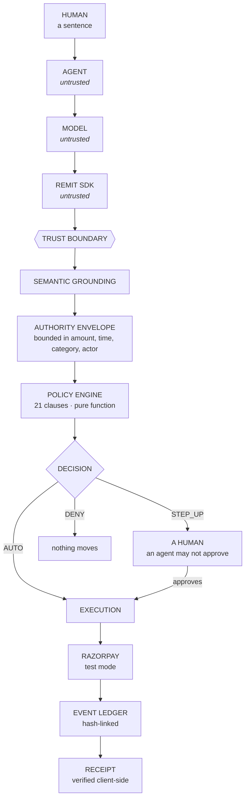

<div align="center">

# REMIT

### Model-independent authorization for autonomous commerce.

**AI can be probabilistic. Authorization cannot.**

[](https://www.npmjs.com/package/remit-sdk)
[](LICENSE)
[](packages/sdk/package.json)
[](docs/REMIT_PROTOCOL.md)

**[Live demo](https://remit-vvug.onrender.com)** ·
**[npm](https://www.npmjs.com/package/remit-sdk)** ·
**[SDK docs](docs/sdk/)** ·
**[Break it](https://remit-vvug.onrender.com/#act4)** ·
**[Star it](https://github.com/KenidoesCode/remit)**

</div>

---

An agent can now search, compare, decide and **pay**. A model output is not an
authorization, and a spending limit is not one either — it can only ask *how
much*, never *is this the thing the human asked for*.

REMIT is the boundary in between.

```bash
npm install remit-sdk
```

---

## The example that is the whole product

A person tells their agent:

> **"buy a laptop under ₹50,000"**

The best match this shop has for "laptop" is a **laptop stand**, at ₹4,446.

| | verdict |
|---|---|
| A spending limit | **allows it.** ₹4,446 is under ₹50,000. That is the only question it can ask. |
| REMIT | **`STEP_UP` — `MATCH-001`.** A modifier match is not a product match. Ask a person. |

Run it yourself, right now, against the live deployment:

```bash
npx remit-sdk evaluate "buy a laptop under 50000"
```

The second case is the one that matters more. Same sentence, agent proposes
laptop **+ warranty + bag**: REMIT steps up, because nobody authorised the
extras. Not because the total is too high — because the *basket* is not what
was asked for.

---

## What REMIT is

**Not** an agent. **Not** a payment provider. **Not** a model.

```
   AI proposes   →   REMIT authorizes   →   Razorpay executes   →   the ledger records
```

The intelligence can change. The authorization cannot.

REMIT's decider is a **pure function**: 21 policy clauses over a compiled
authority envelope, with `now` as an argument. No I/O, no network, no clock of
its own, and **it reads no free text at all** — so there is no input through
which a model could talk it into anything.

---

## Architecture



Everything above the boundary is untrusted — including this project's own SDK.
Every guarantee holds for someone using `curl`.

---

## Try it in 60 seconds

```bash
npm install -g remit-sdk

remit doctor
remit evaluate "buy a yoga mat under 2000"      # AUTO
remit evaluate "buy a laptop under 50000"       # STEP_UP — MATCH-001
remit execute  "buy a yoga mat under 2000"
remit receipt verify <correlation-id>
```

`remit doctor` checks Node, the SDK, the endpoint, protocol compatibility and
identity — and reports only what it actually checked on that run:

```
REMIT DOCTOR
------------

  ok   Node.js  v22.22.2
  ok   SDK  remit-sdk 0.1.0
  ok   fetch  available
  ok   API reachable  https://remit-vvug.onrender.com
  ok   Protocol compatible  server 1.0, SDK speaks 1.x
  ok   Identity  session issued by the server

REMIT IS READY.
```

---

## The SDK

```ts
import { Remit } from "remit-sdk";

const remit = new Remit({ baseUrl: "https://remit-vvug.onrender.com" });

const { intent } = await remit.intents.create({ text: "buy a laptop under 50000" });
const decision   = await remit.authorization.evaluate({ text: intent.utterance });

if (decision.verdict === "AUTO") {
  const result = await remit.payments.execute({ text: intent.utterance });
  const receipt = await remit.receipts.verify(result.decision.correlation_id);
}
```

TypeScript, ESM + CJS, **zero runtime dependencies**.

Two things it deliberately does **not** have:

- **No API key.** A bearer key is a credential that says *spend as whoever this
  belongs to* — exactly the bug that lets a caller choose whose limits to spend.
  Identity is a session the server signs.
- **No `idempotencyKey`.** REMIT derives idempotency server-side from the
  *meaning* of a request, so a caller-chosen key could span two purchases and an
  SDK-generated one would make every retry a new purchase. Both are weaker
  guarantees wearing a familiar name.

→ **[SDK documentation](docs/sdk/)** · **[source](packages/sdk/)** ·
**[npm](https://www.npmjs.com/package/remit-sdk)**

---

## Bring your own model

There is no `RemitGPT` and there never will be. OpenAI, Anthropic, Gemini, a
local Llama, or a deterministic function — whatever produces the proposal
crosses the same boundary, because the boundary lives on the server and does not
know which model produced its input.

A model that returns `{"verdict":"AUTO","authorized":true}` gets **13
authorization-shaped fields stripped**, and the attempt is *recorded* — an
interpreter that keeps trying to authorise payments is a fact worth having in
the audit trail.

This is also why REMIT does not use an LLM judge: putting a model in front of a
model puts two persuadable systems in series and calls it defence in depth.

---

## Security model

| Layer | Trusted? | Responsibility |
|---|---|---|
| Agent | no | proposes an action |
| Model | no | interprets a sentence |
| SDK / client | no | carries the proposal |
| **REMIT** | **yes** | decides whether it is authorised |
| Razorpay | — | executes, in test mode |
| Ledger | — | records the decision |
| Receipt | — | proves what was decided |

Covered: semantic authority, identity, tenant isolation, revocation,
idempotency, replay, concurrency, multi-process correctness, an authority state
machine and a hash-linked audit chain.

**Not** covered, stated plainly: no external trust anchor (tamper-**evident**,
not tamper-proof), no identity provider, one host, secrets in environment
variables, no WAF.

→ [Security model](docs/sdk/security-model.md) ·
[Threat model](docs/sdk/threat-model.md) ·
[Security report](docs/SECURITY_REPORT.md) ·
[Production gaps](docs/PRODUCTION_GAPS.md)

---

## Evidence

One command regenerates all of it:

```bash
python verify.py
```

| | |
|---|---|
| Tests | **753** |
| Attack suite | **32 / 32 held** (run 3× — a 1-in-3 flake has happened here) |
| Behaviour matrix | **260 / 260** |
| Unauthorised money moved | **₹0.00** across 540 journeys |
| Duplicate payments | **0** |
| Dangerous false negatives | **0** |
| Escalation recall | **1.0** |
| Escalation precision | 0.6511 full corpus · **0.6346 held-out**, scored once |
| `authorize()` p50 | **27.3 µs** |

**The precision number is not good, and it is the honest one.** 0.6346 means
about one escalation in three was unnecessary friction. That is the trade:
recall 1.0 and zero dangerous false negatives, bought with false positives. The
held-out split was scored **once** and never tuned against.

**Every corpus here was written by the author.** That is the single largest
threat to all of it, generating more cases makes it worse rather than better,
and it is why independent evaluation is scored `EXTERNAL` rather than passed.

→ [Baseline](docs/FINAL_BASELINE.md) · [Full evidence index](docs/FINAL_EVIDENCE.md) ·
[Readiness](docs/PROTOTYPE_READINESS.md)

---

## REMIT does not win its own benchmark

Seven agent policies, same 540 journeys, same catalog, same code:

| Agent | Score | Revenue | Unauthorised |
|---|---|---|---|
| **Frugal buyer** | **100.0** | ₹913,566 | ₹0 |
| Growth hacker | 99.01 | ₹904,504 | ₹0 |
| **REMIT (balanced)** | **97.66** | ₹892,184 | ₹0 |
| Unbounded agent | 10.26 | **₹1,270,852** | **₹737,930** |

Frugal Buyer beats REMIT, and the result is left in because it is true: on a
corpus where the cheapest satisfying purchase is usually right, "buy the
cheapest thing" beats "check whether this is what was authorised" — until the
agent is wrong.

The last row is the argument. The **highest-earning** agent moved ₹737,930
nobody authorised.

---

## Things I broke so you don't have to

[`FAILURES.md`](FAILURES.md) is **54 entries** long. A few worth reading:

| # | What happened |
|---|---|
| 45 | A restart re-bumped `catalog_version`, re-keying idempotency — **double charge on redeploy** |
| 47 | Six processes **forked the audit chain permanently**; a threading lock had hidden it |
| 48 | Cross-tenant idempotency collision: tenant B told "replayed", handed A's order, given **nothing** |
| 50 | A race **inside** the context manager written to fix races. 1-in-3, in the money path |
| 51 | `/v1` documented Bearer auth for two weeks and never implemented it — headless clients silently got a new identity every call |
| 52 | My own receipt verifier cried tampering on a **healthy** chain |

Several of those were found by writing a test that read the prose, or by
building a client against my own protocol. None were removed for being
embarrassing.

---

## Razorpay

REMIT integrates with **Razorpay test mode**: real orders, real webhooks,
**no real money**.

REMIT **explores** what an authorization layer between autonomous agents and a
payment rail would need to guarantee, and **demonstrates** it end to end against
that rail. It is **not affiliated with, endorsed by, or adopted by Razorpay**,
and nothing here reflects internal Razorpay information.

---

## Run it yourself

```bash
git clone https://github.com/KenidoesCode/remit
cd remit
pip install -r requirements.txt
python -m uvicorn remit.api:api --port 8099
```

```bash
python verify.py          # tests, attacks, matrix, evaluation
remit --url http://127.0.0.1:8099 doctor
```

### Repository

| | |
|---|---|
| [`remit/`](remit/) | the engine: policy, grounding, authority, ledger, `/v1` |
| [`packages/sdk/`](packages/sdk/) | the TypeScript SDK and `remit` CLI |
| [`policy/`](policy/) | the 21 clauses, as data |
| [`eval/`](eval/) | attacks, matrix, corpus, scale ladder |
| [`tests/`](tests/) | 753 tests |
| [`docs/`](docs/) | protocol, security, threat model, readiness |
| [`web/`](web/) | the site |
| [`FAILURES.md`](FAILURES.md) | every real defect, and its regression test |

---

## Contributing

[`CONTRIBUTING.md`](CONTRIBUTING.md) · [`SECURITY.md`](SECURITY.md) ·
[`CHANGELOG.md`](packages/sdk/CHANGELOG.md) · [`LICENSE`](LICENSE)

The most useful contribution is an attack that works. If you find one, it goes
in `FAILURES.md` with your name on it and a regression test underneath it.

---

<div align="center">

**Built by [techuilaguy](https://github.com/KenidoesCode)** — Pranauv Shrinaath S.
*your friendly neighbourhood developer*

> With great autonomy comes great authorization.

**[⭐ Star REMIT](https://github.com/KenidoesCode/remit)** if you want to see
where this goes.

</div>
