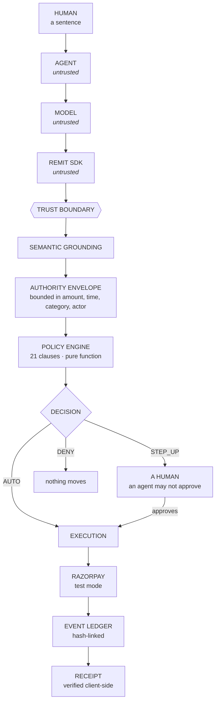

<div align="center">

<picture>
  <source media="(prefers-color-scheme: dark)" srcset="web/brand/remit-lockup-dark.svg">
  
</picture>

### Model-independent authorization for autonomous commerce.

**AI can be probabilistic. Authorization cannot.**

[](https://www.npmjs.com/package/remit-sdk)
[](LICENSE)
[](packages/sdk/package.json)
[](docs/REMIT_PROTOCOL.md)

**[Live demo](https://remit-vvug.onrender.com)** ·
**[npm](https://www.npmjs.com/package/remit-sdk)** ·
**[Docs](docs/)** ·
**[SDK](docs/sdk/)** ·
**[Break it](https://remit-vvug.onrender.com/#act4)**

</div>

---

## What REMIT is

An agent can now search, compare, decide and **pay**. A model output is not an
authorization, and a spending limit is not one either — it can only ask *how
much*, never *is this the thing the human asked for*.

REMIT is the boundary in between. **Not** an agent. **Not** a payment provider.
**Not** a model.

```
   AI proposes   →   REMIT authorizes   →   Razorpay executes   →   the ledger records
```

```bash
npm install remit-sdk
```

---

## The problem, in one purchase

A person tells their agent:

> **"buy a laptop under ₹50,000"**

The best match this shop has for "laptop" is a **laptop stand**, at ₹4,446.

| | verdict |
|---|---|
| A spending limit | **allows it.** ₹4,446 is under ₹50,000. That is the only question it can ask. |
| REMIT | **`STEP_UP` — `MATCH-001`.** A modifier match is not a product match. Ask a person. |

Run it yourself against the live deployment:

```bash
npx remit-sdk evaluate "buy a laptop under 50000"
```

The second case matters more. Same sentence, agent proposes laptop **+ warranty
+ bag**: REMIT steps up, because nobody authorised the extras. Not because the
total is too high — because the *basket* is not what was asked for.

**Why it matters:** an agent with a payment key will eventually be wrong. The
question is not whether the model is good; it is what the system does on the
occasion the model is confident and mistaken.

---

## Architecture



Everything above the boundary is untrusted — including this project's own SDK.
Every guarantee holds for someone using `curl`.

---

## How authorization works

A sentence becomes a **bounded authority**, and every proposed action is checked
against it by a function that cannot be argued with.

1. **Compile.** The utterance becomes an *intent envelope*: immutable,
   versioned, bounded in amount, time, category and actor. Its `semantic_hash`
   covers meaning only — not ids, not timestamps.
2. **Ground.** The agent's proposed basket is matched against the catalog.
   Ranking is deterministic; the model never scores a product.
3. **Decide.** [`remit/policy/authorize.py`](remit/policy/authorize.py) runs
   **21 clauses** over the envelope. It is a **pure function**: `now` is an
   argument, there is no I/O, no network, no clock of its own — and **it reads
   no free text at all**, so there is no input through which a model could talk
   it into anything.
4. **Record.** The decision, every clause and its detail, is appended to a
   hash-linked ledger before anything else happens.

### What happens when an action exceeds authority

| verdict | meaning | who can clear it |
|---|---|---|
| `AUTO` | inside the envelope on every clause | nobody needs to |
| `STEP_UP` | plausible, but not what was authorised | **a human only** — an agent may not approve on its own behalf |
| `DENY` | outside a hard clause (restricted goods, revoked authority, expired mandate) | nobody. Nothing moves. |

A step-up is a real request to the running engine that states *what* is being
approved. A boolean cannot answer the only question a dispute asks: approved
**what**?

---

## How payments are protected

- **Idempotency is derived from meaning**, server-side:
  `H(tenant : user : semantic_hash | cart_signature | total | catalog_version)`.
  A `UNIQUE` constraint on that key is the serialisation point — 40 threads and
  12 processes each produce exactly **one** payment, and it survives a restart.
- **There is no client-supplied idempotency key.** A caller-chosen key can span
  two different purchases; an SDK-generated one makes every retry a new one.
- **The boundary is server-side.** `test_no_bypass.py` drives the entire public
  surface and then asks the database whether anything moved.
- **Razorpay test mode is enforced in code.** A key that does not begin
  `rzp_test_` is refused.

## Authorization receipts

REMIT does not merely return a verdict. Every money-moving decision leaves an
**authorization receipt**: the authority that was granted, the decision and the
clauses behind it, whether money actually moved, and the audit chain — assembled
into one view from records that already exist. It is a projection, not a second
source of truth: nothing in the receipt can say something the underlying tables
do not.

```bash
remit receipt show   <correlation-id>   # the receipt, in one view
remit receipt verify <correlation-id>   # recompute every hash locally
```

```ts
const receipt = await remit.receipts.get(correlationId);
receipt.decision.verdict;      // "AUTO" | "STEP_UP" | "DENY"
receipt.execution.money_moved; // false for a step-up or a denial
receipt.self_reported_chain;   // "intact" — the chain's own view

// To check it rather than trust it:
const v = await remit.receipts.verify(correlationId);
v.ok;  // recomputed from the raw bytes, not taken on the server's word
```

A denial or step-up produces a receipt too — one that says, in as many words,
*no money moved* and names the clause that stopped it. That is the failure case,
explained.

→ `GET /v1/receipt/{correlation_id}` · [SDK: audit & receipts](docs/sdk/audit.md)

## The audit trail

Every event carries who, what, when and why, and each links to the one before
it: `sha256(prev_hash + canonical({kind, trace_id, ts, payload}))`.

`receipts.verify()` **recomputes every hash locally** rather than repeating the
server's claim about itself, and it will not return `ok: true` for a check it
could not run.

> **Tamper-evident, not tamper-proof.** There is no external trust anchor. A
> single writer proves ordering, not honesty. That distinction is stated
> everywhere it appears rather than glossed.

---

## Install and use

```bash
npm install remit-sdk        # library
npm install -g remit-sdk     # the `remit` CLI
```

```ts
import { Remit } from "remit-sdk";

const remit = new Remit({ baseUrl: "https://remit-vvug.onrender.com" });

const { intent } = await remit.intents.create({ text: "buy a laptop under 50000" });
const decision   = await remit.authorization.evaluate({ text: intent.utterance });

if (decision.verdict === "AUTO") {
  const result  = await remit.payments.execute({ text: intent.utterance });
  const receipt = await remit.receipts.verify(result.decision.correlation_id);
}
```

TypeScript, ESM + CJS, **zero runtime dependencies**.

Two things it deliberately does **not** have:

- **No API key.** A bearer key says *spend as whoever this belongs to* — exactly
  the bug that lets a caller choose whose limits to spend. Identity is a session
  the server signs.
- **No `idempotencyKey`.** See above. Both are weaker guarantees wearing a
  familiar name.

### Try it in 60 seconds

```bash
remit doctor
remit evaluate "buy a yoga mat under 2000"      # AUTO
remit evaluate "buy a laptop under 50000"       # STEP_UP — MATCH-001
remit execute  "buy a yoga mat under 2000"
remit receipt verify <correlation-id>
```

`remit doctor` checks Node, the SDK, the endpoint, protocol compatibility and
identity — and reports only what it actually checked on that run.

### Run the whole thing locally

```bash
git clone https://github.com/KenidoesCode/remit
cd remit
pip install -r requirements.txt
python -m uvicorn remit.api:api --port 8099
```

```bash
python verify.py                              # tests, attacks, matrix, evaluation
remit --url http://127.0.0.1:8099 doctor
```

→ [Setup](docs/SETUP.md) · [Deployment](docs/DEPLOY.md) · [Protocol](docs/REMIT_PROTOCOL.md)

---

## Bring your own model

There is no `RemitGPT` and there never will be. OpenAI, Anthropic, Gemini, a
local Llama, or a deterministic function — whatever produces the proposal
crosses the same boundary, because the boundary lives on the server and does not
know which model produced its input.

A model that returns `{"verdict":"AUTO","authorized":true}` gets **13
authorization-shaped fields stripped**, and the attempt is *recorded* — an
interpreter that keeps trying to authorise payments is a fact worth having in
the audit trail.

This is also why REMIT does not use an LLM judge: putting a model in front of a
model puts two persuadable systems in series and calls it defence in depth.

---

## Security model

| Layer | Trusted? | Responsibility |
|---|---|---|
| Agent | no | proposes an action |
| Model | no | interprets a sentence |
| SDK / client | no | carries the proposal |
| **REMIT** | **yes** | decides whether it is authorised |
| Razorpay | — | executes, in test mode |
| Ledger | — | records the decision |
| Receipt | — | proves what was decided |

Covered: semantic authority, identity, tenant isolation, revocation,
idempotency, replay, concurrency, multi-process correctness, an authority state
machine and a hash-linked audit chain.

**Not** covered, stated plainly: no external trust anchor, no identity provider,
one host, secrets in environment variables, no WAF.

→ [Security model](docs/sdk/security-model.md) ·
[Threat model](docs/THREAT_MODEL.md) ·
[Security report](docs/SECURITY_REPORT.md) ·
[Production gaps](docs/PRODUCTION_GAPS.md)

---

## Evidence

One command regenerates all of it:

```bash
python verify.py
```

| | |
|---|---|
| Tests | **828** |
| Attack suite | **32 / 32 held** (run 3× — a 1-in-3 flake has happened here) |
| Behaviour matrix | **260 / 260** |
| Unauthorised money moved | **₹0.00** across 540 journeys |
| Duplicate payments | **0** |
| Dangerous false negatives | **0** |
| Escalation recall | **1.0** |
| Escalation precision | 0.6511 full corpus · **0.6346 held-out**, scored once |
| Decision latency | p50 3.42 ms · p95 **4.71 ms** (`authorize()` itself: 27.3 µs) |

**The precision number is not good, and it is the honest one.** 0.6346 means
about one escalation in three was unnecessary friction. That is the trade:
recall 1.0 and zero dangerous false negatives, bought with false positives. The
held-out split was scored **once** and never tuned against.

**Every corpus here was written by the author.** That is the single largest
threat to all of it, generating more cases makes it worse rather than better,
and it is why independent evaluation is scored `EXTERNAL` rather than passed.

→ [Baseline](docs/FINAL_BASELINE.md) · [Evidence index](docs/FINAL_EVIDENCE.md) ·
[Readiness](docs/PROTOTYPE_READINESS.md) · [Evaluation method](docs/EVALUATION.md)

---

## REMIT does not win its own benchmark

Seven agent policies, same 540 journeys, same catalog, same code:

| Agent | Score | Revenue | Unauthorised |
|---|---|---|---|
| **Frugal buyer** | **100.0** | ₹913,566 | ₹0 |
| Growth hacker | 99.01 | ₹904,504 | ₹0 |
| **REMIT (balanced)** | **97.66** | ₹892,184 | ₹0 |
| Unbounded agent | 10.26 | **₹1,270,852** | **₹737,930** |

Frugal Buyer beats REMIT, and the result is left in because it is true: on a
corpus where the cheapest satisfying purchase is usually right, "buy the
cheapest thing" beats "check whether this is what was authorised" — until the
agent is wrong.

The last row is the argument. The **highest-earning** agent moved ₹737,930
nobody authorised.

---

## Known limitations

Stated here rather than in a footnote, because they are the reason the numbers
above are worth reading:

- **Razorpay test mode only.** Real orders, real webhooks, no real money.
- **Synthetic catalog and corpus**, 186 products, one seed, written by the author.
- **One host.** Multi-process correctness is tested; multi-host is a design.
- **No identity provider.** A signed session is a real boundary and is not SSO,
  MFA or federation.
- **Tamper-evident, not tamper-proof.** No external trust anchor.
- **Prototype readiness is scored criterion by criterion and it is not 100.**

→ [Limitations](docs/LIMITATIONS.md) · [Production gaps](docs/PRODUCTION_GAPS.md) ·
[0 → 100 audit](docs/FINAL_0_TO_100_AUDIT.md)

---

## Things I broke so you don't have to

[`FAILURES.md`](FAILURES.md) is **55 entries** long. A few worth reading:

| # | What happened |
|---|---|
| 45 | A restart re-bumped `catalog_version`, re-keying idempotency — **double charge on redeploy** |
| 47 | Six processes **forked the audit chain permanently**; a threading lock had hidden it |
| 48 | Cross-tenant idempotency collision: tenant B told "replayed", handed A's order, given **nothing** |
| 50 | A race **inside** the context manager written to fix races. 1-in-3, in the money path |
| 51 | `/v1` documented Bearer auth for two weeks and never implemented it |
| 52 | My own receipt verifier cried tampering on a **healthy** chain |

Several were found by writing a test that read the prose, or by building a
client against my own protocol. None were removed for being embarrassing.

---

## Razorpay

REMIT integrates with **Razorpay test mode**: real orders, real webhooks,
**no real money**.

REMIT **explores** what an authorization layer between autonomous agents and a
payment rail would need to guarantee, and **demonstrates** it end to end against
that rail. It is **not affiliated with, endorsed by, or adopted by Razorpay**,
and nothing here reflects internal Razorpay information.

---

## Repository

| | |
|---|---|
| [`remit/`](remit/) | the engine: policy, grounding, authority, ledger, `/v1` |
| [`packages/sdk/`](packages/sdk/) | the TypeScript SDK and `remit` CLI |
| [`policy/`](policy/) | the 21 clauses, as data |
| [`eval/`](eval/) | attacks, matrix, corpus, scale ladder |
| [`tests/`](tests/) | 828 tests |
| [`docs/`](docs/) | protocol, architecture, security, threat model, readiness |
| [`web/`](web/) | the site |
| [`FAILURES.md`](FAILURES.md) | every real defect, and its regression test |

## Contributing

[`CONTRIBUTING.md`](CONTRIBUTING.md) · [`SECURITY.md`](SECURITY.md) ·
[`CODE_OF_CONDUCT.md`](CODE_OF_CONDUCT.md) ·
[`CHANGELOG.md`](packages/sdk/CHANGELOG.md) · [`LICENSE`](LICENSE)

The most useful contribution is an attack that works. If you find one, it goes
in `FAILURES.md` with your name on it and a regression test underneath it.

---

<div align="center">

**Built by [techuilaguy](https://github.com/KenidoesCode)** — Pranauv Shrinaath S.

> With great autonomy comes great authorization.

**[⭐ Star REMIT](https://github.com/KenidoesCode/remit)** if you want to see
where this goes.

</div>
